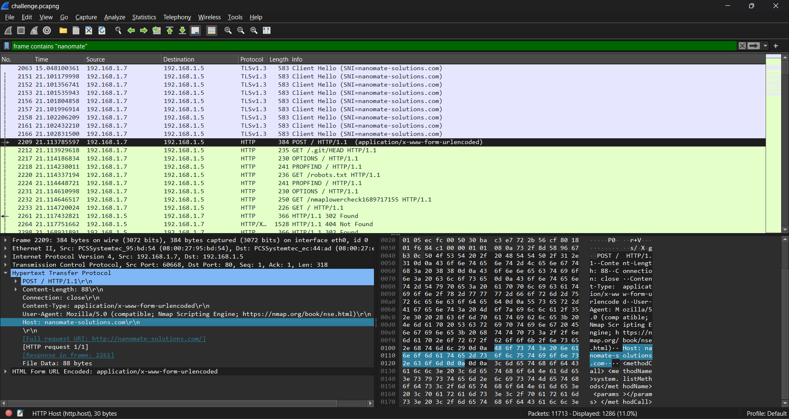
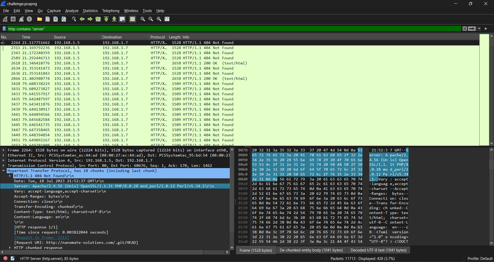
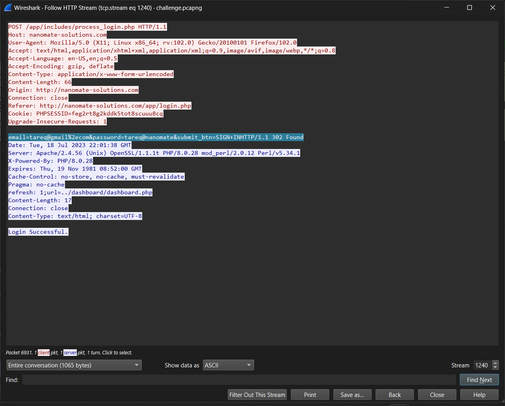

# Praktikum-Jarkom-Modul-1

# Anggota

| Nama                            | NRP          |
| ------------------------------- | ------------ |
| Marcelinus Alvinanda Chrisantya | `5027221012` |
| Bintang Ryan Wardana            | `5027221022` |

## 1. ATM or ATP or FTP
1. Langkah pertama yang dilakukan adalah mencari `protocol FTP` yang mengindikasikan adanya request/response terkait dengan login yaitu input username dan password. Ditemukan salah satunya yaitu `response : 331 Please specify the password`

2. Kemudian, saya mem-follow packet tersebut untuk melihat semua stream yang serupa

3. Untuk mencari password yang correct, saya mengecek satu per satu setiap stream hingga akhirnya menemukan `Login successful` pada stream 319 dengan passwordnya adalah `m4y_th3_Kn!fe_ch1p_&_sh4tter`

## 2. evidence

1. Untuk mencari domain dari client "nanomate", saya menggunakan filter frame dengan nama dari client yaitu nanomate. `frame contains "nanomate"`

2. Untuk mencari web service yang digunakan dari nanomate, saya melakukan filter "server" pada display filter. `http contains "server"`

3. Untuk mencari endpoint login website, saya menggunakan filter `http contains "POST"`. Alasannya karena proses login biasanya menggunakan method POST.

4. Terakhir untuk melihat email dan password yang berhasil digunakan attacker untuk masuk ke dalam sistem nanomate, saya melakukan filtering kata Login Successful. Berikut querynya `Frame contains "Login Successful"`

## 3. How Many Packets?
1. Dalam melakukan bruteforce login tentunya attacker akan melakukan banyak `login incorrect` dan `1x login succesful`, maka dari itu untuk menghitung total login attempt adalah dengan menjumlahkan total packet dengan response login incorrect dan 1 response login successful. Langkah pertama yang saya lakukan adalah mencari packet dengan info `Login incorrect` secara manual.

2. kemudian melakukan filter `ftp.response.code == 530` untuk menampilkan semua packet dengan info `Login incorrect`

3. Kemudian `apply as filter > selected` untuk melihat total displayed login attempt incorrect yaitu sebanyak `933 login attempt`

4. Dengan informasi tersebut, dapat dihitung total login attempt yang dilakukan attacker yaitu : 
`Total login attempt : 934`
incorrect login attempt : 933
correct login attempt : 1

## 4. trace him
1. Untuk mendapatkan IP address attacker maka dapat dilihat melalui salah satu packet, disini packet yang saya analisis adalah packet `Login incorrect` yang merupakan response dari IP server untuk IP attacker. Maka dapat disimpulkan bahwa IP attacker adalah `IP destination` packet tersebut yaitu : `10.30.3.4`

## 5. creds

## 6. malwleowleo 

## 7. whoami

## 8. secret

## 9. fuzz
1. Untuk menemukan IP address milik attacker, saya mencoba menganalisis salah satu packet yang merupakan packet upaya login oleh attacker. Saya melakukan `filter http` dan mencari packet HTTP POST karena POST berarti attacker mencoba melakukan request berupa login attempt. Dapat dilihat pada packet 105 tersebut attacker mencoba melakukan login dengan uname = admin dan password = password, hal ini menjadi bukti bahwa packet ini direquest oleh attacker.  Maka dari itu, `IP source : 10.33.1.154`  tentunya merupakan IP dari requester yaitu attacker itu sendiri.

2. Dengan packet yang dianalisis sebelumnya, ditemukan juga informasi port yang digunakan oleh web server korban yaitu destination port. `Destination port(80)` merupakan port web server korban karena packet tersebut direquest oleh attacker dengan destinasinya adalah web server korban

3. Untuk mengetahui endpoint yang digunakan untuk login, dapat dilihat melalui info packet POST yaitu seperti berikut :
Pada packet tersebut dapat dilihat bahwa endpoint yang digunakan untuk login adalah `/(slash)`.

4. Untuk mencari tools yang digunakan oleh attacker, saya menganalisis packet yang sama juga dengan soal sebelumnya yaitu packet 105. Kemudian saya melakukan `follow http stream` packet tersebut dan ditemukan informasi berikut.
Dapat dilihat dengan jelas informasi attacker salah satunya adallah tools yang digunakan yaitu `Fuz Faster U Fool v2.0.0-dev`. Kemudian dengan menyeseuaikan format pertanyaan, tools yang digunakan adalah `ffuf-v2.0.0-dev`

5. Dalam konteks web server, respons `302 found` biasanya digunakan untuk mengarahkan client(dalam hal ini attacker) ke suatu halaman atau url lain setelah client berhasil melakukan login ke web server. Maka dari itu, langkah pertama yang saya lakukan dalah melakukan filter `http.response.code == 302` untuk menemukan packet dengan response 302 found.

Kemudian saya melakukan `follow HTTP stream` terhadap packet tersebut

Untuk menemukan login attempt yang berhasil dilakukan attacker, saya melakukan `find : 302 found` pada HTTP Stream tersebut

Setelah melakukan find terhadap HTTP stream tersebut, ditemukan salah satu login attempt dengan code 302 found dan ditemukan juga username beserta password yang berhasil digunakan oleh attacker yaitu `admin:sUp3rSecretp@ssw0rd`

## 10. malwaew 
